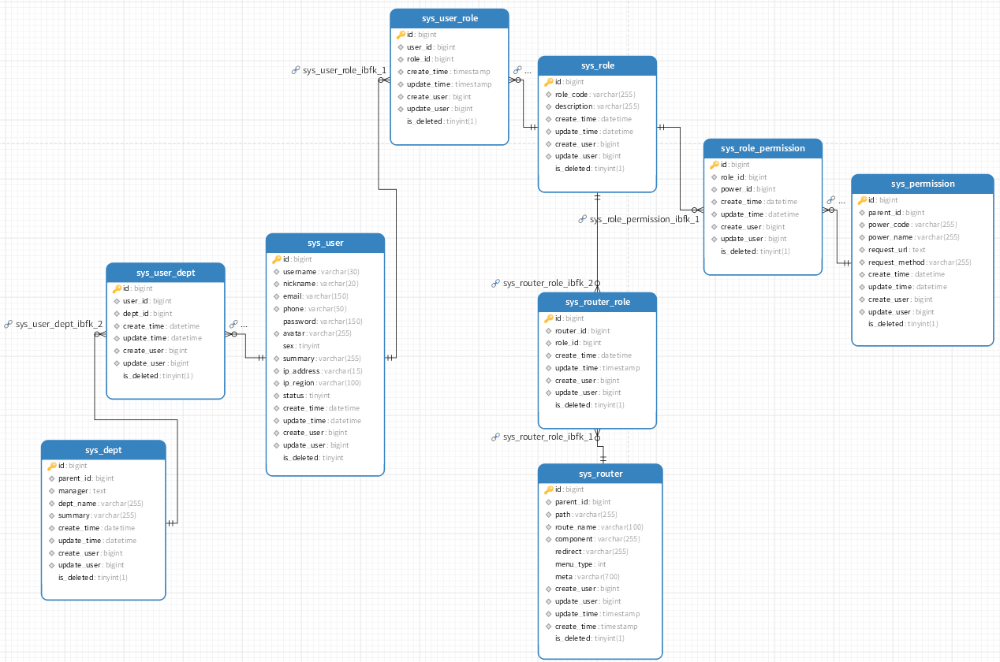
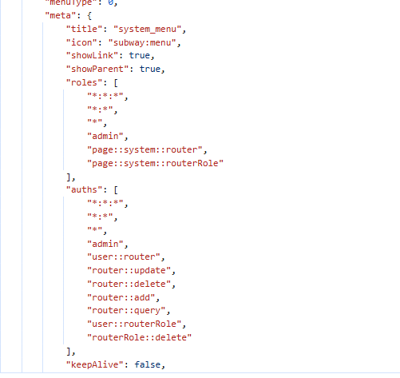

# BunnyAuth动态权限控制简介


> [!IMPORTANT]
>
> 开源权限模板[Pure-admin](https://pure-admin.github.io/vue-pure-admin/)
>
> **Pure-admin文档**：https://pure-admin.github.io/pure-admin-doc
>
> **默认凭证**
>
> 项目中有一个默认管理员，数据库中用户`id`是`1`：
>
> 用户名：`Administrator`
>
> 密码：`admin123`

> [!WARNING]
>
> 如果刚初始化登录的时候，发现管理员【`Administrator`】密码错误。
>
> 找到数据库`sys_user`，将`Administrator`替换成下面的密码。
>
> `$2a$10$h5BUwmMaVcEuu7Bz0TPPy.PQV8JP6CFJlbHTgT78G1s0YPIu2kfXe`

可粗可细的权限控制，多平台文件上传。

## 📽️视频说明地址

**介绍视频视频**

- [RBAC中URL的权限数据库、后端设计](https://www.bilibili.com/video/BV1nGVazrEKf/)
- [bunny-admin 配置说明](https://www.bilibili.com/video/BV177VazMEiM/)
- [Bunny-Admin 用户相关操作](https://www.bilibili.com/video/BV1B7VazME72/)
- [Bunny-Admin 角色权限](https://www.bilibili.com/video/BV1ELVazzEnC/)
- [Bunny-Admin 剩下的业务逻辑](https://www.bilibili.com/video/BV1ELVazzE7S/)
- [代码生成器](https://www.bilibili.com/video/BV1d4Lxz9E3j/?vd_source=d42b5b664efb958be39eef8ee1196a7e)

**Github地址**

- 权限后端：https://github.com/BunnyMaster/bunny-admin-server
- 权限前端：https://github.com/BunnyMaster/bunny-admin-web
- 代码生成器端：https://github.com/BunnyMaster/generator-code-server

**Gitee地址**

- 权限后端：https://gitee.com/BunnyBoss/bunny-admin-server
- 权限前端：https://gitee.com/BunnyBoss/bunny-admin-web
- 代码生成器端：https://gitee.com/BunnyBoss/generator-code-server

## 🚀 项目简介

一个基于 Spring Security 6 的现代化动态权限控制系统，提供完整的 RBAC 权限管理解决方案。支持前后端分离架构，可灵活配置细粒度权限控制。

## 😋控制器上注解说明

整个项目是基于URL，方便定义权限接口，即使项目中接口不存在，通过URL的方式增删权限。

比如项目需要为`dept`分配了角色，这个角色可以访问`dept`下所有的接口，那么就可以写成`api/dept/**`，如果需要`dept`下某个接口，`/api/dept/aaa/bbb`，这种形式。

如果针对分页查询，分页参数写在URL上的，可以这样做，`/api/dept/*/*`这样就可以做到灵活的权限控制。

但是在部分场景下，接口就是我们的权限，这时如果手动一个一个添加URL很麻烦，所以使用的swagger自带的注解和`PermissionTag`，自定义的注解的方式，如果这时的项目需求是，为整个接口添加权限，就可以用反射的方式添加。

使用放射的方式已经放在controller的目录下，看`ReadMe`文档即可。

## ✨重大更新

### 核心改进

**v4.0.0**

- **全面重构**：后端接口、实体类等重构，前端重构部分j+优化操作体验
- **批量操作支持**：
  - ✅菜单管理：完善属性内容
  - ✅ 权限管理：支持 JSON/Excel 导入导出
  - ✅ 角色管理：支持 Excel 批量更新
  - ✅ 多语言配置：支持 JSON/Excel 更新（全量替换模式）

**v4.0.1**

- 文件系统支持多平台，只需要手动配置即可。
- 有需要参考文档：https://x-file-storage.xuyanwu.cn/#/
- 文件删除和下载等需要实现对应接口`FileRecorder `，目前以实现，对应代码和控制器都在文件夹`file`下，如有需要修改可以参考【x-file-storage】文档修改。

## 🧠用法提示

> [!TIP]
>
> 多语言使用提示：
>
> 虽然直接让用户操作JSON文件有一定门槛（多数用户不熟悉JSON格式），但在多语言项目开发中，JSON格式具有独特优势：
>
> 1. 结构化特性 - 纯文本格式便于AI解析处理
> 2. 高效翻译流程：
>    - 开发者只需完成中文版本
>    - 上传JSON文件至AI翻译工具
>    - 简单指令即可批量生成英文/繁体中文/韩语等版本
> 3. 显著节省开发时间 - 实现"一次编写，多语言适配"的高效工作流

## 🔐 权限控制体系



### 访问规则配置

通过 `WebSecurityConfig` 配置

| 路径类型 | 示例              | 访问要求 | 配置方式                  |
| -------- | ----------------- | -------- | ------------------------- |
| 公开接口 | `/api/public/**`  | 无需认证 | 路径包含 `public` 关键字  |
| 私有接口 | `/api/private/**` | 需登录   | 路径包含 `private` 关键字 |

### 路径匹配策略

```java
public static String[] annotations = { ... };

// 配置示例
http.authorizeHttpRequests(auth -> auth
    .authorizeHttpRequests(authorize -> authorize
    .requestMatchers(annotations).permitAll()
);
```

### Maven工程结构

```
bunny-auth/
├── auth-api      # 接口定义层
├── auth-core     # 核心模块
│   ├── config    # 安全配置
│   └── domain    # domain
│   └── ......    # 还要很多...
├── service       # 业务实现
└── dao           # 数据持久层
```

## 🛠️ 应用场景

### 1. 纯前端控制模式

前端原理详情查看Pure文档：https://pure-admin.cn/pages/RBAC/#%E5%A6%82%E4%BD%95%E9%85%8D%E7%BD%AE



- **页面控制**：
  1. 为路由菜单分配角色
  2. 为用户分配角色
- **按钮控制**：
  ```ts
  // 前端权限码配置
  const auth = {
    add: ['i18nType::add'],
    update: ['i18nType::update'],
    delete: ['i18nType::delete'],
  };
  ```

### 2. 纯后端控制模式

- 接口级权限：分页这种就可以添加为`/api/permission/*/*`

  ```java
  @Tag(name = "系统权限")
  @PermissionTag(permission = "permission::*")
  @RestController
  @RequestMapping("api/permission")
  public class PermissionController {
      @Operation(summary = "分页查询")
      @PermissionTag(permission = "permission::query")
      @GetMapping("{page}/{limit}")
      public Result<PageResult<PermissionVo>> getPermissionPage(
          @PathVariable Integer page,
          @PathVariable Integer limit) {
          // ...
      }
  }
  ```

### 3. 全栈控制模式

前两个结合

## 🛡️ 安全配置

### 路径匹配策略

AntPath详情：https://juejin.cn/spost/7498247273660743732

| 模式     | 示例            | 说明             |
| -------- | --------------- | ---------------- |
| 精确匹配 | `/api/user`     | 完全匹配路径     |
| 通配符   | `/api/user/*`   | 匹配单级路径     |
| 多级通配 | `/api/user/**`  | 匹配多级路径     |
| 方法限定 | `GET /api/user` | 匹配特定HTTP方法 |

## 🧰 技术栈

### 😄前端

- Vue 3 + PureAdmin 模板
- 自定义权限组件
- 国际化支持

### 😃后端

- Spring Boot 3 + Spring Security 6
- JDK 17
- MySQL + Redis + MinIO
- Swagger + Knife4j 文档

### 😀开发环境

根据不同docker 启动方式不一样

```bash
# 一键启动依赖服务
docker-compose up -d
# 新版的docker
docker compose up -d
```

## 📚 最佳实践

1. **注解规范**：
   ```java
   @Tag(name = "模块名称", description = "模块描述")
   @Operation(summary = "接口摘要", tags = {"权限码"})
   // 或者
   @Operation(summary = "接口摘要", tags = "权限码")
   ```
2. **权限码设计**：

   - 模块::操作 (如 `user::create`)
   - 分层级设计 (如 `system:user:update`)

3. **批量操作**：
   - 使用 Excel/JSON 管理大量权限配置
   - 定期备份权限配置

## 🌟 项目优势

1. **真正的动态控制** - 无需硬编码权限逻辑
2. **灵活的数据导入** - 支持多种文件格式
3. **细粒度控制** - 从页面到按钮的多层级权限
4. **现代化技术栈** - 基于最新 Spring 生态
5. **开箱即用** - 提供完整 Docker 部署方案

## 📌 注意事项

1. 多语言更新会完全替换现有配置
2. 生产环境建议禁用 Swagger 端点
3. 复杂权限建议使用 Excel 批量管理

## 📈 后续规划

暂无

## 📏前后端接口规范

### 🌐前端示例规范

| **操作** | **API 层**    | **Pinia 层**    |
| :------- | :------------ | :-------------- |
| 查询单个 | `getUser`     | `loadUser`      |
| 查询列表 | `getUserList` | `loadUserList`  |
| 分页查询 | `getUserPage` | `fetchUserPage` |
| 新增数据 | `createUser`  | `addUser`       |
| 更新数据 | `updateUser`  | `editUser`      |
| 删除数据 | `deleteUser`  | `removeUser`    |

### 🛟后端接口示例规范

遵循Restful

| **操作** | **RESTful**                 |
| :------- | :-------------------------- |
| 查询列表 | `GET /users`                |
| 分页查询 | `GET /users/{page}/{limit}` |
| 查询单个 | `GET /users/{id}`           |
| 新增     | `POST /users`               |
| 更新     | `PUT /users/{id}`           |
| 删除     | `DELETE /users/{id}`        |


