Github地址

- [前端地址](https://github.com/BunnyMaster/bunny-admin-web.git)
- [后端地址](https://github.com/BunnyMaster/bunny-admin-server)

Gitee地址

- [前端地址](https://gitee.com/BunnyBoss/bunny-admin-web)
- [后端地址](https://gitee.com/BunnyBoss/bunny-admin-server)

# 功能介绍

系统使用的是物理删除，但是引用了逻辑删除，使用mybatisPlus如果需要逻辑删除只需要将原先删除方法调用成mybatisplus自身的删除方法即可。

作为权限管理系统，校验功能已经路由功能都是由后端完成，后端使用SpringSecurity

系统权限功能使用RBAC模型

## 系统设置

### 系统菜单

当用户登录时会根据，当前角色获取自身的菜单路由，防止返回不该返回的页面，之后权限和角色关联，根据用户权限查询可以访问的菜单内容，如果权限中没有这个路径那么会告知`无权访问`。

管理员需要在配置时，配置菜单和角色之间的关系，用户也要和角色关联，角色会关联权限表，返回路由时只返回当前用户可以访问的菜单。

- 前端做递归，排序后端也做了
- 快捷排序，快捷禁用菜单
- 路由菜单图标需要再系统配置中添加菜单图标

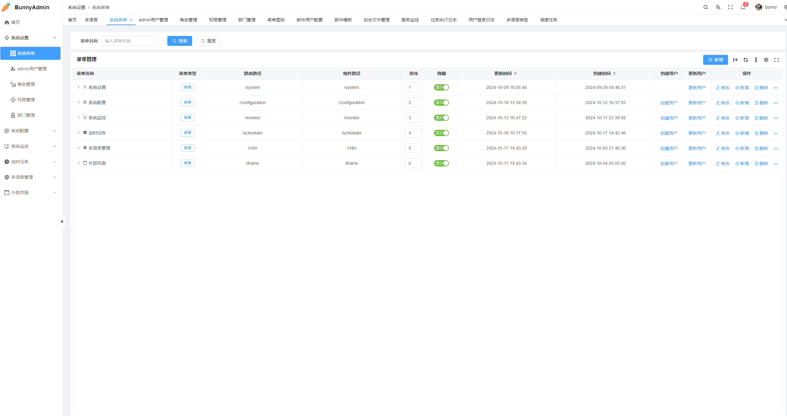

为菜单分配角色

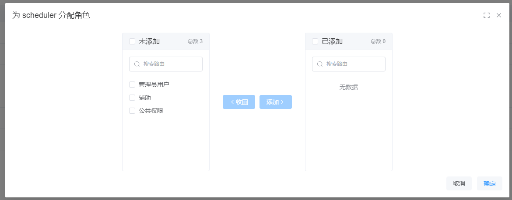

### 用户管理

强制下线就是将Redis中用户信息删除

用户禁用先改数据库之后将Redis中数据进行删除

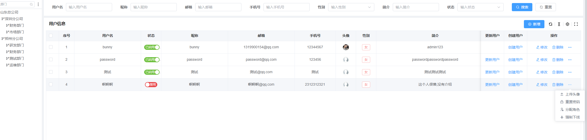

#### 关于用户管理事务问题

如果用户禁用失败或者删除Redis失败需要回滚事务，在Spring中，有集成的事务，只需要简单的配置下即可，

### 角色管理

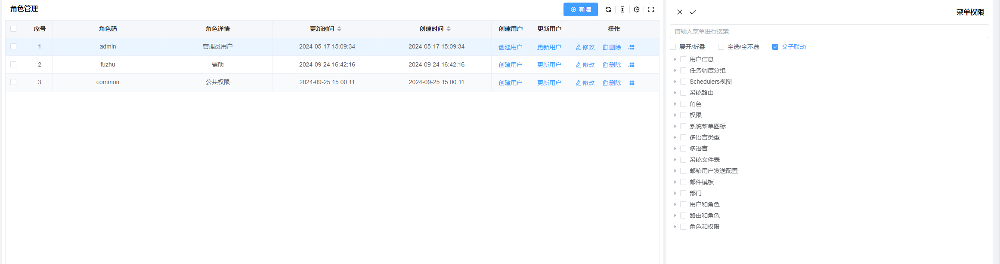

### 权限管理

权限管理可以设置父级内容，在前端文件中有`data.js`，可以自动生成权限相关内容。

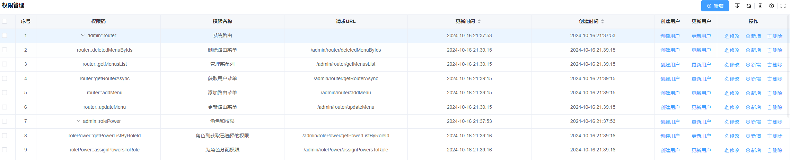

**前端文件**

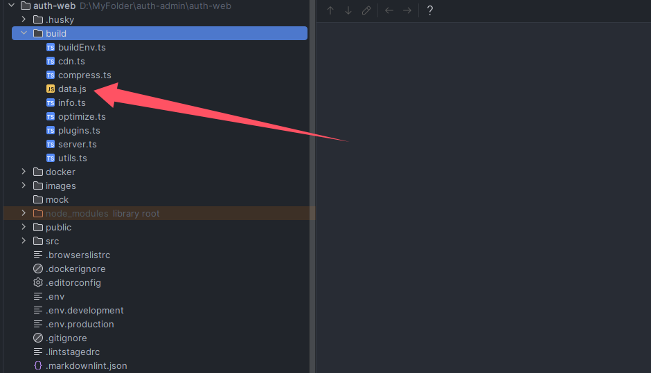

### 部门管理

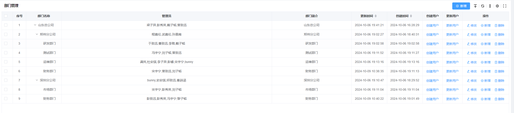

## 系统配置

### 菜单图标

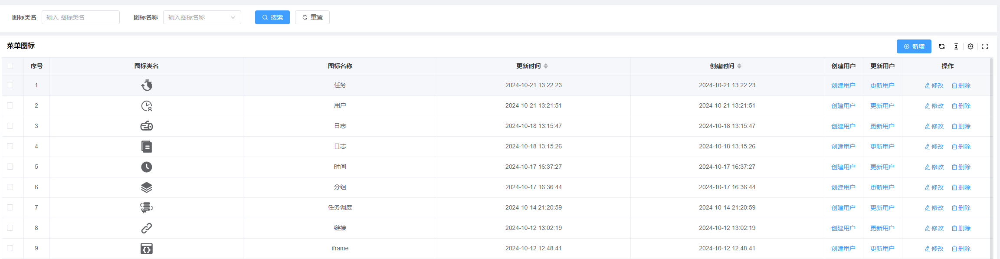

### 邮件用户配置

发送邮件时，如果没有选定用户会去找默认用户，如果默认用户也没有会报错。

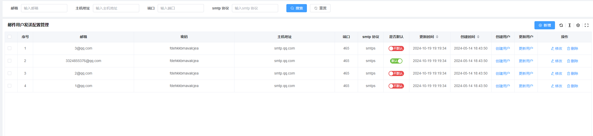

### 邮件模板

邮箱验证码，

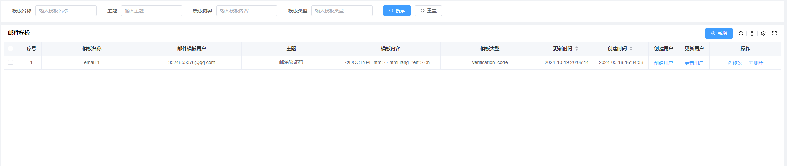

#### 模板类型说明

根据后端的枚举类进行返回

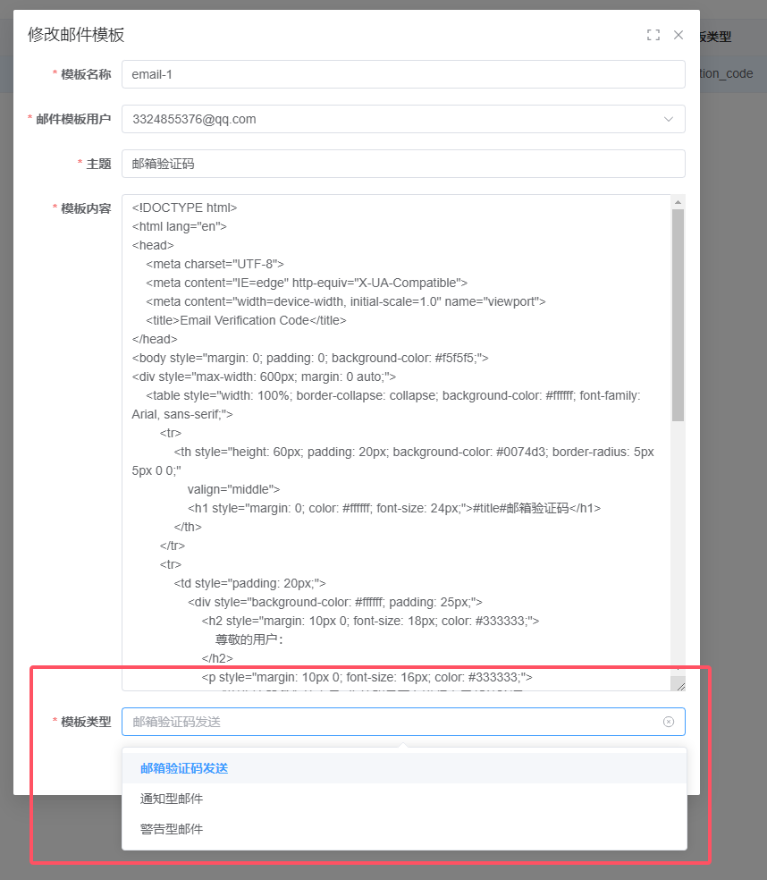

后端文件

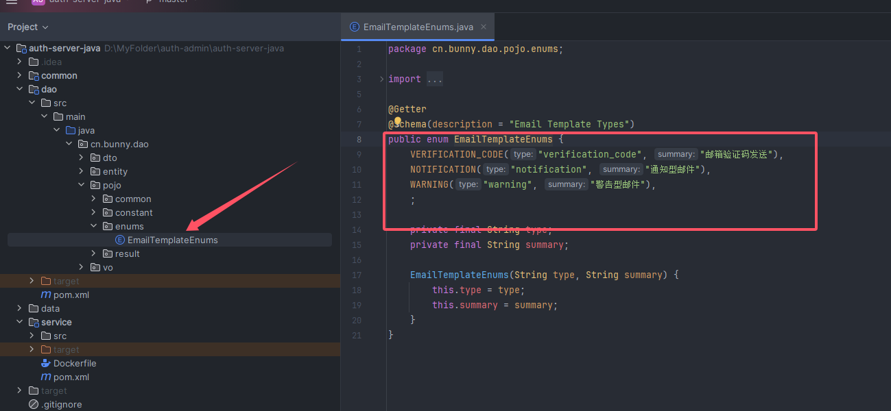

## 系统监控

### 服务监控

服务监控来自springboot中actuator框架

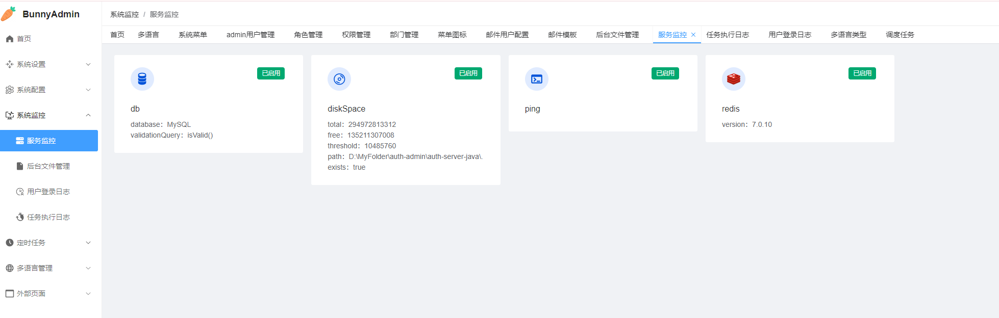

IDEA中也有集成只要使用了actuator包即可看到服务内容、健康检查等

详细参考官网API，当然如果需要后台服监控页面，德国工程师帮我们写了一个页面。

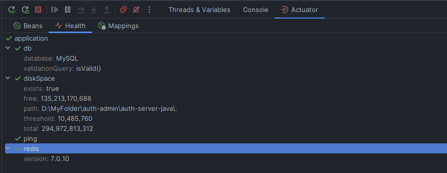

也可以看到当前的请求API有哪些

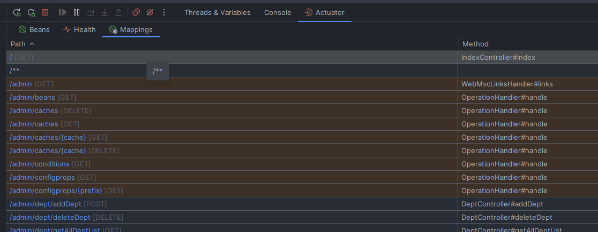

#### 相关admin服务包

或许在有些服务中不需要这个页面，有服务监控的功能，配置也简单，我之前我使用在这个项目中，和部分业务功能有些冲突，与其这样不如自己写个简单的也可以

```xml

<dependency>
  <groupId>de.codecentric</groupId>
  <artifactId>spring-boot-admin-starter-server</artifactId>
  <version>3.3.4</version>
</dependency>
<dependency>
<groupId>de.codecentric</groupId>
<artifactId>spring-boot-admin-starter-client</artifactId>
<version>3.2.3</version>
</dependency>
```

### 后台文件管理

用户上传的文件和头像内容都在这里，文件存储位置在Minio中

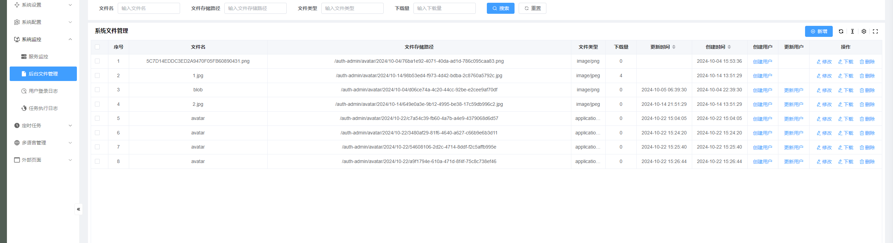

### 用户登录日志

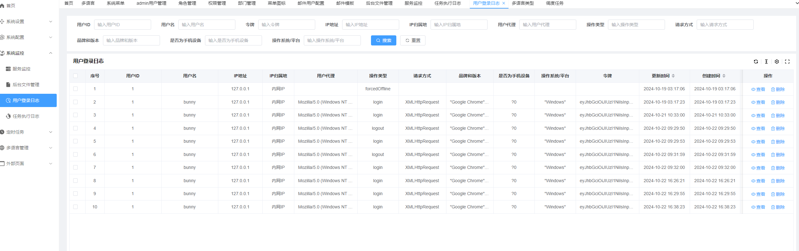

### 任务执行日志

当前设定的定时任务有关，目前有数据库备份，和简单的定时任务示例内容都在这，使用JS对象可视化，数据多时会有些卡顿


## 定时任务

### 调度任务

其实就是定时任务，集成框架quartz，持久化存储任务

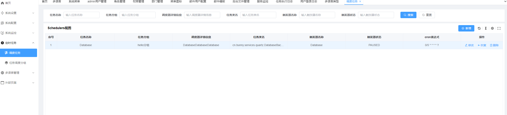

### 任务调度分组

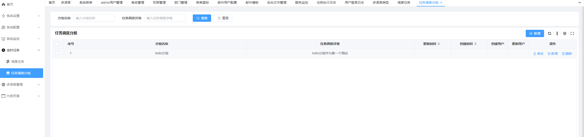

## 多语言管理

### 多语言

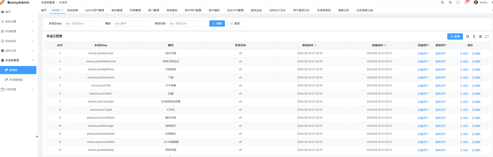

### 多语言类型

如果以后还需要其它语言可以在这个地方添加

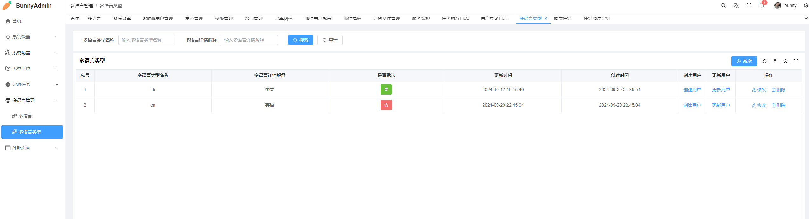

## 其它功能

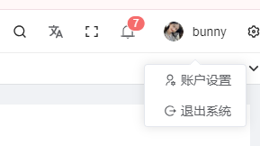

### 账户设置

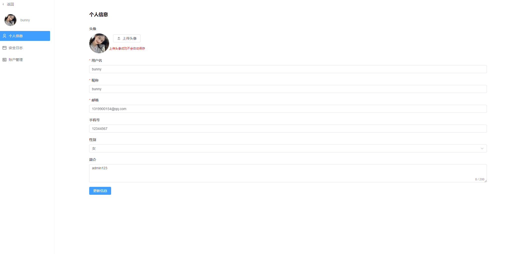

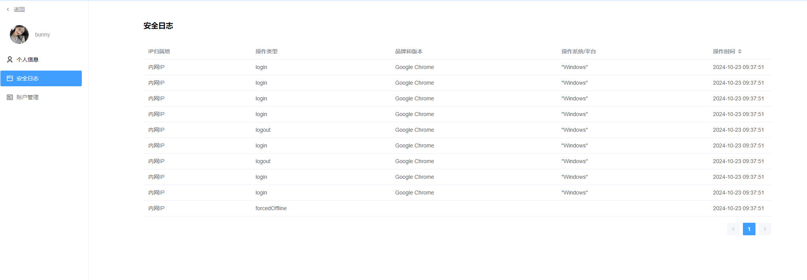

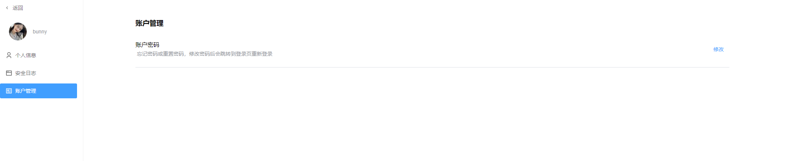

### 数据库事务

数据库事务在Springboot中只需要一个注解，通常我们还需要redis事务，在Redis中配置开启即可。

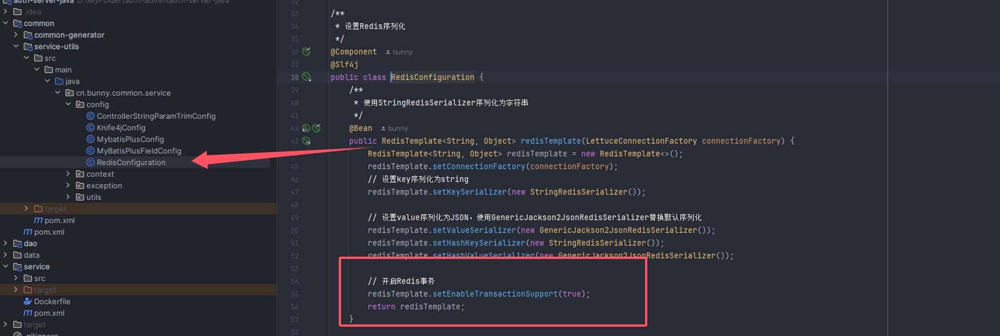

### 去除字符串空格

在项目中，会统一进行空白字符串去除，配置项也在config文件夹下


> 更多配置看这里
>
> 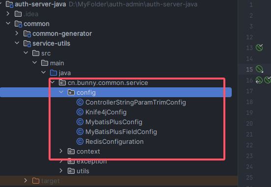

# Docker配置详情

如果想更改端口号，前面的对外访问的端口号，后面是容器也就是服务本身端口号


项目本身端口号
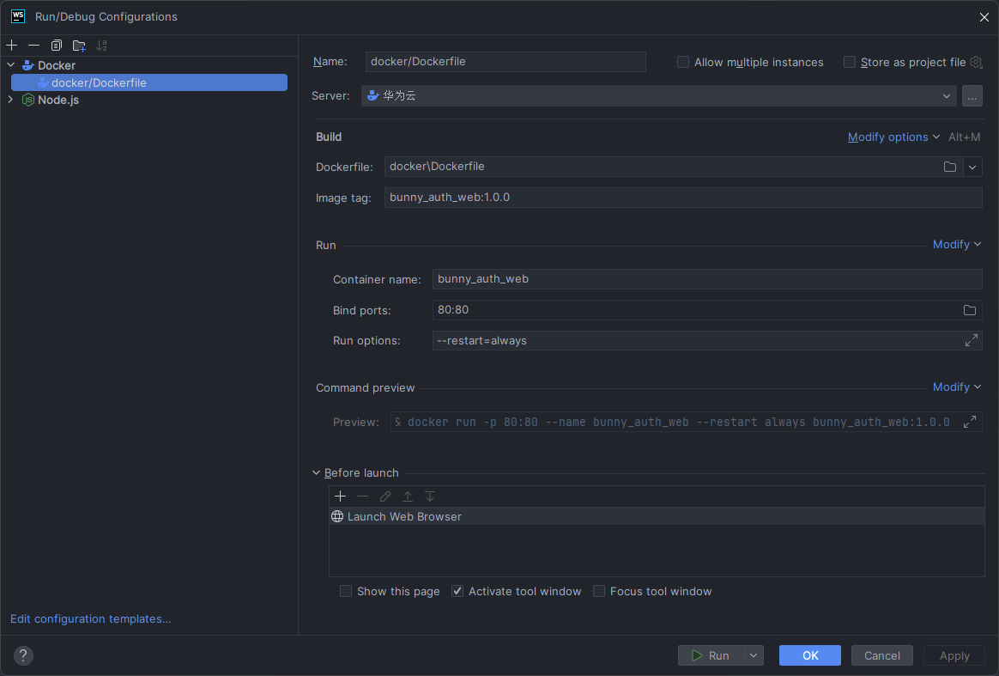

部署命令

```bash
docker build -f Dockerfile -t bunny_auth_web:1.0.0 . && docker run -p 80:80 --name bunny_auth_web --restart always bunny_auth_web:1.0.0 
```

# 展望未来

1. 数据库备份时上传到Minio
2. 数据库备份后可恢复
3. 定时邮件发送参数可在前端配置，动态形式
4. 首页看板内容