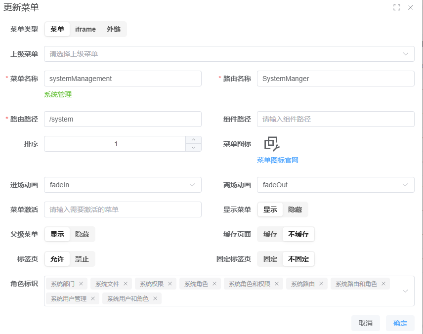
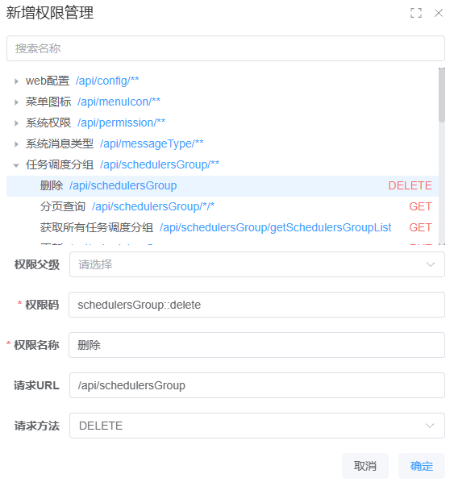

# BunnyAuth动态权限控制简介

> [!IMPORTANT]
>
> 前端项目整体都由此模板开发
>
> 项目由[小铭](https://github.com/xiaoxian521)开源权限模板[Pure-admin](https://pure-admin.github.io/vue-pure-admin/)
>
> **Pure-admin文档**：https://pure-admin.github.io/pure-admin-doc

> [!TIP]
>
> 项目中有一个默认管理员，数据库中用户`id`是`1`：
>
> 用户名：`Administrator`
>
> 密码：`admin123`

> [!WARNING]
>
> 如果刚初始化登录的时候，发现管理员【`Administrator`】密码错误。
>
> 找到数据库`sys_user`，将`Administrator`替换成下面的密码。
>
> `$2a$10$h5BUwmMaVcEuu7Bz0TPPy.PQV8JP6CFJlbHTgT78G1s0YPIu2kfXe`

## 视频说明地址

**介绍视频视频**

- [环境搭建](https://www.bilibili.com/video/BV17odHY6E3S/?spm_id_from=333.1387.homepage.video_card.click&vd_source=d42b5b664efb958be39eef8ee1196a7e)
- [运行项目](https://www.bilibili.com/video/BV1qodHYzErA/?spm_id_from=333.1387.homepage.video_card.click&vd_source=d42b5b664efb958be39eef8ee1196a7e)
- [前端部署](https://www.bilibili.com/video/BV1BddHYgEPq/?spm_id_from=333.1387.homepage.video_card.click&vd_source=d42b5b664efb958be39eef8ee1196a7e)
- [后端部署](https://www.bilibili.com/video/BV1BddHYgEFt/?spm_id_from=333.1387.homepage.video_card.click&vd_source=d42b5b664efb958be39eef8ee1196a7e)
- [代码生成器](https://www.bilibili.com/video/BV1d4Lxz9E3j/?vd_source=d42b5b664efb958be39eef8ee1196a7e)

**Github地址**

- 权限后端：https://github.com/BunnyMaster/bunny-admin-server
- 权限前端：https://github.com/BunnyMaster/bunny-admin-web
- 代码生成器端：https://github.com/BunnyMaster/generator-code-server

**Gitee地址**

- 权限后端：https://gitee.com/BunnyBoss/bunny-admin-server
- 权限前端：https://gitee.com/BunnyBoss/bunny-admin-web
- 代码生成器端：https://gitee.com/BunnyBoss/generator-code-server

## 🚀 项目简介

一个基于 Spring Security 6 的现代化动态权限控制系统，提供完整的 RBAC 权限管理解决方案。支持前后端分离架构，可灵活配置细粒度权限控制。

## ✨ v4.0.0 重大更新

### 核心改进

- **全面重构**：后端接口、实体类等重构，前端重构部分j+优化操作体验
- **批量操作支持**：
  - ✅菜单管理：完善属性内容
  - ✅ 权限管理：支持 JSON/Excel 导入导出
  - ✅ 角色管理：支持 Excel 批量更新
  - ✅ 多语言配置：支持 JSON/Excel 更新（全量替换模式）

### 技术亮点

- **注解扫描**：通过 `AnnotationScanner.java` 自动扫描想要的注解

  ```java
  // 示例：扫描特定注解的类
  public static Set<Class<?>> getClassesWithAnnotation(Class<?> annotation) {
      // 实现细节...
  }
  ```

- **应用场景**：
  - 定时任务配置
  - 权限接口发现

### 界面优化




## :tipping_hand_man:用法提示

> [!TIP]
>
> 多语言使用提示：
>
> 虽然直接让用户操作JSON文件有一定门槛（多数用户不熟悉JSON格式），但在多语言项目开发中，JSON格式具有独特优势：
>
> 1. 结构化特性 - 纯文本格式便于AI解析处理
> 2. 高效翻译流程：
>    - 开发者只需完成中文版本
>    - 上传JSON文件至AI翻译工具
>    - 简单指令即可批量生成英文/繁体中文/韩语等版本
> 3. 显著节省开发时间 - 实现"一次编写，多语言适配"的高效工作流

## 🔐 权限控制体系


### 访问规则配置

通过 `WebSecurityConfig` 配置

| 路径类型 | 示例              | 访问要求 | 配置方式                  |
| -------- | ----------------- | -------- | ------------------------- |
| 公开接口 | `/api/public/**`  | 无需认证 | 路径包含 `public` 关键字  |
| 私有接口 | `/api/private/**` | 需登录   | 路径包含 `private` 关键字 |

### 路径匹配策略

```java
public static String[] annotations = { ... };

// 配置示例
http.authorizeHttpRequests(auth -> auth
    .authorizeHttpRequests(authorize -> authorize
    .requestMatchers(annotations).permitAll()
);
```

### Maven工程结构

```mermaid
graph TD

父工程 -->|主项目| auth-api
父工程 -->|代码生成器| generator-code
auth-api -->|启动项、控制器| service
service -->|mapper| dao
service -->|包含domain、配置等| auth-core
dao -->|包含domain、配置等| auth-code


```

## 🛠️ 应用场景

### 1. 纯前端控制模式

前端原理详情查看Pure文档：https://pure-admin.cn/pages/RBAC/#%E5%A6%82%E4%BD%95%E9%85%8D%E7%BD%AE


- **页面控制**：
  1. 为路由菜单分配角色
  2. 为用户分配角色
- **按钮控制**：
  ```ts
  // 前端权限码配置
  const auth = {
    add: ['i18nType::add'],
    update: ['i18nType::update'],
    delete: ['i18nType::delete'],
  };
  ```

### 2. 纯后端控制模式

- 接口级权限：分页这种就可以添加为`/api/permission/*/*`

  ```java
  @Tag(name = "系统权限")
  @RestController
  @RequestMapping("api/permission")
  public class PermissionController {
      @Operation(summary = "分页查询", tags = {"permission::page"})
      @GetMapping("{page}/{limit}")
      public Result<PageResult<PermissionVo>> getPermissionPage(
          @PathVariable Integer page,
          @PathVariable Integer limit) {
          // ...
      }
  }
  ```

### 3. 全栈控制模式

前两个结合

## 🛡️ 安全配置

### 路径匹配策略

AntPath详情：https://juejin.cn/spost/7498247273660743732

| 模式     | 示例            | 说明             |
| -------- | --------------- | ---------------- |
| 精确匹配 | `/api/user`     | 完全匹配路径     |
| 通配符   | `/api/user/*`   | 匹配单级路径     |
| 多级通配 | `/api/user/**`  | 匹配多级路径     |
| 方法限定 | `GET /api/user` | 匹配特定HTTP方法 |

## 🧰 技术栈

### 前端

- Vue 3 + PureAdmin 模板
- 自定义权限组件
- 国际化支持

### 后端

- Spring Boot 3 + Spring Security 6
- JDK 17
- MySQL + Redis + MinIO
- Swagger + Knife4j 文档

### 开发环境

根据不同docker 启动方式不一样

```bash
# 一键启动依赖服务
docker-compose up -d
# 新版的docker
docker compose up -d
```

## 📚 最佳实践

1. **注解规范**：
   ```java
   @Tag(name = "模块名称", description = "模块描述")
   @Operation(summary = "接口摘要", tags = {"权限码"})
   // 或者
   @Operation(summary = "接口摘要", tags = "权限码")
   ```
2. **权限码设计**：

   - 模块::操作 (如 `user::create`)
   - 分层级设计 (如 `system:user:update`)

3. **批量操作**：
   - 使用 Excel/JSON 管理大量权限配置
   - 定期备份权限配置

## 🌟 项目优势

1. **真正的动态控制** - 无需硬编码权限逻辑
2. **灵活的数据导入** - 支持多种文件格式
3. **细粒度控制** - 从页面到按钮的多层级权限
4. **现代化技术栈** - 基于最新 Spring 生态
5. **开箱即用** - 提供完整 Docker 部署方案

## 📌 注意事项

1. 多语言更新会完全替换现有配置
2. 生产环境建议禁用 Swagger 端点
3. 复杂权限建议使用 Excel 批量管理

## 📈 后续规划

- [ ] 权限级别拖拽
- [ ] 权限树型结构动态添加、更新、删除
- [ ] 用户设置持久化存储到数据库
- [ ] 权限弹窗页面优化
- [x] 后端文档注释完善
- [x] 系统监控后端返回403停止请求
- [x] 优化用户配置权限逻辑，配置后热更新逻辑等
- [x] 完善后端注释，有需要添加ReadMe文档
- [ ] Redis中获取活跃用户

## 前后端接口规范

### 前端示例规范

| **操作** | **API 层**    | **Pinia 层**    |
| :------- | :------------ | :-------------- |
| 查询单个 | `getUser`     | `loadUser`      |
| 查询列表 | `getUserList` | `loadUserList`  |
| 分页查询 | `getUserPage` | `fetchUserPage` |
| 新增数据 | `createUser`  | `addUser`       |
| 更新数据 | `updateUser`  | `editUser`      |
| 删除数据 | `deleteUser`  | `removeUser`    |

### 后端接口示例规范

遵循Restful

| **操作** | **RESTful**                 |
| :------- | :-------------------------- |
| 查询列表 | `GET /users`                |
| 分页查询 | `GET /users/{page}/{limit}` |
| 查询单个 | `GET /users/{id}`           |
| 新增     | `POST /users`               |
| 更新     | `PUT /users/{id}`           |
| 删除     | `DELETE /users/{id}`        |


